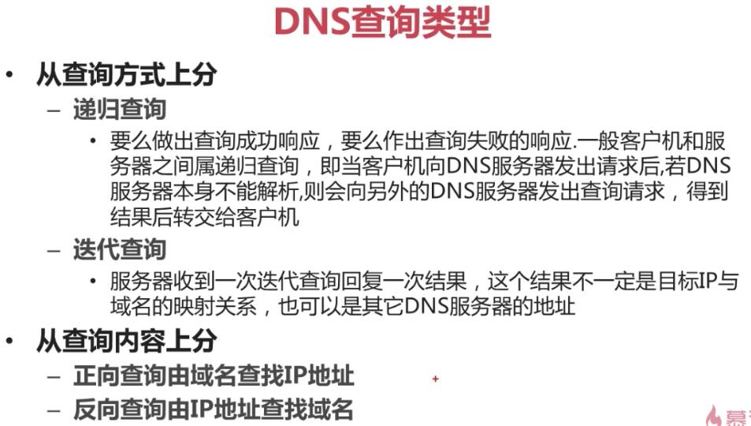

# 网络基础


    MAC地址负责局域网通信，IP地址负责外网通信
    TPDU：传输协议数据单元
    SPDU：会话协议数据单元
    PPDU：层协议数据单元
    APDU：应用协议数据单元

    上三层：为用户提供服务
        应用层、表示层、会话层
    下四层：为数据传递提供服务的
        传输层、网络层、数据链路层、物理层
## TCP/IP四层模型

    TCP/IP四层模型：
    应用层
    传输层
    网际互联层
    网络接口层


> IP地址


    网络地址：IP地址  && 子网掩码，将主机位设置为0
    广播地址：IP地址  && 子网掩码，将主机位设置为1


> 端口的功能


```sh
    netstat -an     # 查看本机启动的端口
    选项：
        -a：查看所有连接和监听端口
        -n：显示IP地址和端口号，而不显示域名和服务名
```

> DNS

    不配置DNS是不能访问互联网的
    DNS：Domain Name System的缩写，也是域名系统的缩写，也称为名称解析


    从Hosts文件到DNS
    早期Hosts文件解析域名
        名称解析效能下降
        主机维护困难
    DNS服务
        层次性
        分布式


    域名空间结构也称为完全合格域名
    "." 表示根域名，根域名的服务器只有13台
    
    组织域：
        gov：政府部门
        com：商业部门
        edu：教育部门
        org：民间团体组织
        net：网络服务机构
        mil：军事部门
    国家或地区域
        cn：中国
        jp：日本
        uk：英国
        au：澳大利亚
        hk：中国香港
    
    三级域 + 二级域 + 顶级域 组成完整域名空间，全球唯一
    如：www.imooc.com

    防范钓鱼网站
    主要看 二级域名和三级域名的结合
    



    网关作用：
    网关：getway又称为网间连接器、协议转换器。
    在网络层以上实现网络互连，是最为复杂的网络互连设备，仅用于两个高层协议不同的网络互连。
    网关即可用于广域网互连，也可用于局域网互连。
    网关是一种充当转换重任的服务器或路由器。

    网关再所有内网计算机访问的不是本网段的数据时使用。
    网关负责将内网IP转换为公网IP，公网IP转换为内网IP。


# Linux 网络命令

```sh
    ifconfig eth0 192.168.1.142 netmask 255.255.255.0
```

# 远程登陆工具