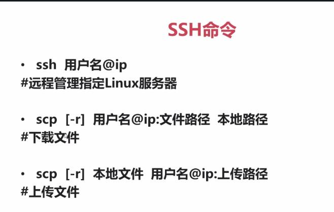

## 远程登陆工具
### ssh

SSH（安全外壳协议）为 Secure Shell 的缩写，SSH 是目前较可靠，专为远程登录会话和其他网络服务提供安全性的协议。利用 SSH 协议可以有效防止远程管理过程中的信息泄露问题。

SSH采用的是非对称加密方式进行加密。

```sh
# SSH登陆命令   ssh 用户名@ip
ssh lemaker@192.168.1.100

# linux与linux之间的文件传输命令
# scp -r 原始文件  目标文件
scp [-r] 用户名@ip:文件路径 本地路径       #下载文件，参数-r为目录
scp [-r] 本地文件 用户名@ip:上传路径       #上传文件

# 例如
scp /home/python_code/client.py ip@192.168.1.200:/home/client.py

```

