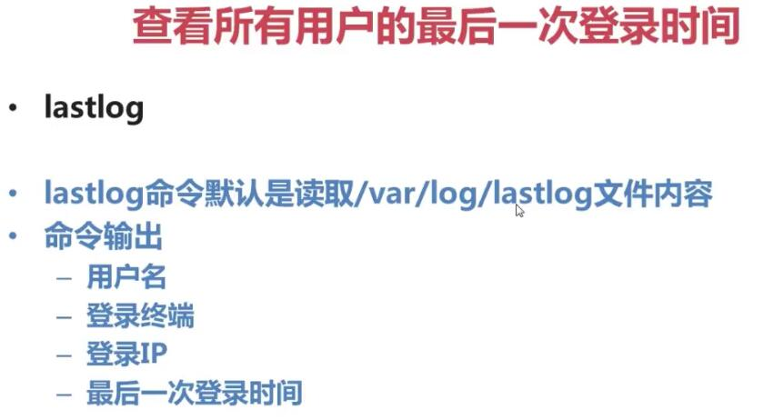

# 挂载命令

查询与自动挂载
```sh
    mount   #查询系统中已经挂载的设备
    mount -a        #依据配置文件/etc/fstab的内容，自动挂载
```

挂载命令格式
   
    mount [-t 文件系统] [-o 特殊选项] 设备文件名 挂载点
    选项：
        -t 文件系统：加入文件系统类型来指定挂载的类型，可以ext3、ext4、iso9660等文件系统
        -o 特殊选项：可以指定挂载的额外选项


```sh
    mount -o remount,noexec /home   # 重新挂载/home分区，并且使用noexec权限，既没有执行权限
    mount -o remount,exec /home # 修改为有执行权限
```

三个空目录挂载点

    media：挂载光盘
    misc：挂载磁带机
    mnt：挂载U盘

也可以在mnt下创建 cdrom文件夹 挂载光盘，创建 USB文件 挂载U盘

```sh
    mkdir /mnt/cdrom/   #建立光盘挂载点
    mount -t iso9660 /dev/sr0 /mnt/cdrom/     # 挂载光盘，优先
    
    mount -t iso9660 /dev/cdrom /mnt/cdrom/     # 挂载光盘
```

卸载命令
    umount 设备文件名或挂载点
```sh
    umount /mnt/cdrom       # 方式一
    umount /dev/sr0         # 方式二
```
挂载U盘
```sh
    fdisk -l    # 查看系统

    mount -t vfat /dev/sdb1 /mnt/usb/
    # 注意：linux默认是不支持NTFS文件系统的
```

ubuntu挂载exfat格式的U盘
```sh
    sudo apt-get install exfat-utils    # ubuntu 14.04版本

    # ubuntu 12.04~13.04版本
    sudo add-apt-repository ppa:relan/exfat 
    sudo apt-get update
    sudo apt-get install exfat-utils fuse-exfat
```

用户登陆查看


