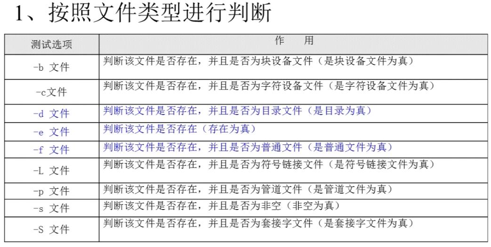
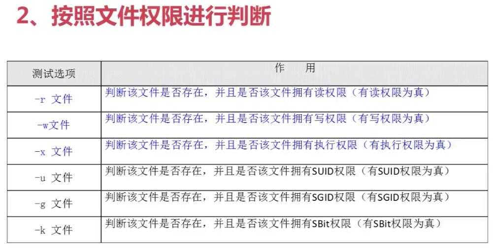
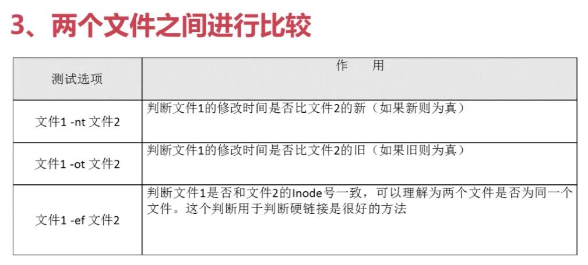
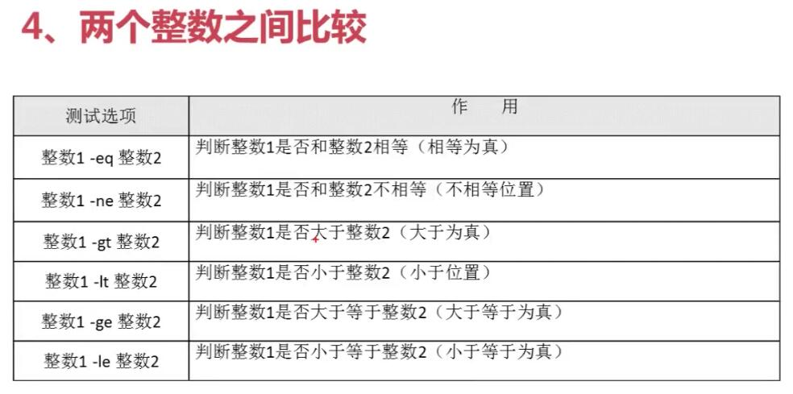
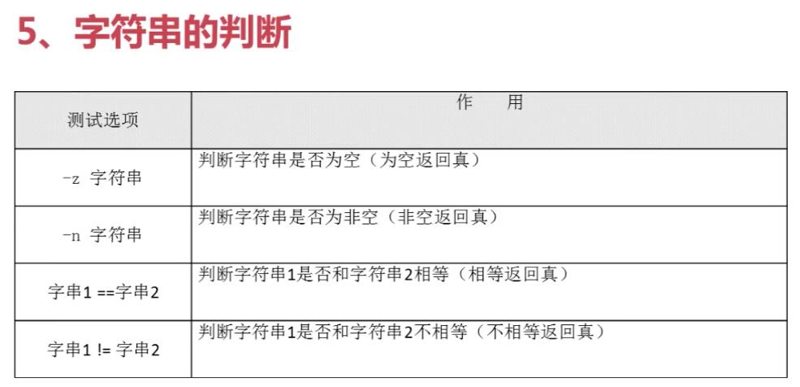
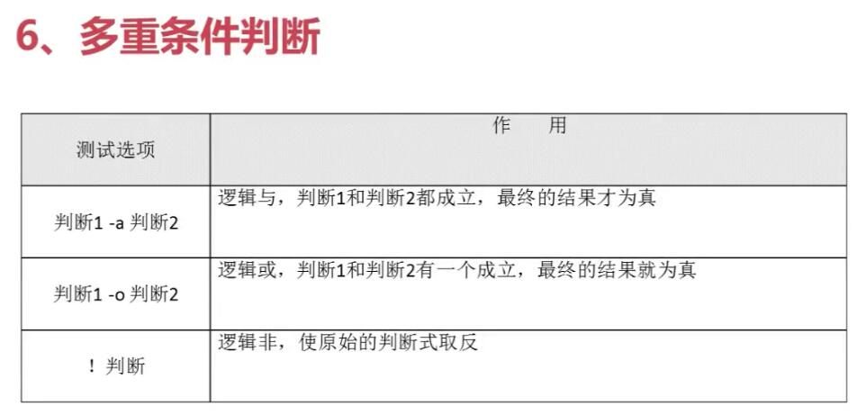

<!-- TOC -->

- [第一章 条件判断式语句](#第一章-条件判断式语句)
- [第二章 单分支if语句](#第二章-单分支if语句)
- [第三章 双分支if语句](#第三章-双分支if语句)
- [第四章 多分支if语句](#第四章-多分支if语句)
- [第五章 多分支case语句](#第五章-多分支case语句)
- [第六章 for循环](#第六章-for循环)
- [第七章 while循环和until循环](#第七章-while循环和until循环)
- [第八章 课程总结](#第八章-课程总结)

<!-- /TOC -->

# 第一章 条件判断式语句



两种判断格式
```sh
    test -e /root/install.log
    [ -e /root/install.log ]

    [ -e /root/install.log ] && echo yes || echo no 
    #第一个判断命令正确执行，打印“yes”，否则打印“no”
```

```sh
    [ -w /root/install.log ] && echo yes || echo no
    # 判断文件是否拥有写权限
```


    快速记忆：
    -nt：new time
    -ot：old time
    -ef：equal file   是否为相同的源文件

```sh
    ln /root/student.txt /tmp/stu.txt   #创建一个硬链接
    [/root/student.txt -ef /tmp/stu.txt]  && echo yes || echo no
```


    -eq：equal           等于
    -ne：not equal       不等于
    -gt：gleater than     大于
    -lt：less then       小于
    -ge：gleater or equal    大于等于
    -le：less or equal       小于等于

```sh
    [ 22 -ge 23 ] && echo yes || echo no
```

```sh
    name=tom
    [ -z $name ] && echo yes || echo no #返回no
    
    aa=11
    bb=22
    [ "$aa" == "$bb" ] && echo yes || echo no   # 字符串判断，返回no
    [ "$aa" -eq "$bb"] && echo yes || echo no   # 数值判断，返回no
```

```sh
    aa=1
    [ -n "$aa" ] && echo yes || echo no     # 变量aa为非空字符串为真，返回yes
    [ "$aa" -gt 34 ] && echo yes || echo no  # 11>34? 返回no
    [ -n "$aa" -a "$aa" -gt 34 ] && echo yes || echo no      # yes && no? 返回no
    
    aa =11
    [ -n "$aa" -a "$aa" -eq 11 ] && echo yes || echo no      # yes && yes? 返回yes
```
# 第二章 单分支if语句
学习小脚本的好处：
- 1.掌握语法结构
- 2.了解shell的作用
- 3.分析编程思想

建立编程思想的方法：
- 1.熟悉Linux基本命令、规范、语法及shell语法
- 2.当遇到实际需求时，应用所学知识

如何"背"程序
- 1.抄写老师的程序并能正确运行
- 2.为程序补全注释
- 3.删掉注释，为代码重新加注释
- 4.看注释写代码
- 5.删掉代码和注释，从头开始写代码

```sh
    if [ 条件表达式 ] ; then  # 第一种格式
        程序
    fi

    if [ 条件表达式 ]    #第二种格式
        then
        程序
    fi
```
```sh
    # 判断登陆的用户是否为root
    #!/bin/bash

    test=$(env | grep "USER" | cut -d "=" -f 2)
    if [ "$test" == "root" ]
        then
        echo "Current user is root"
    fi
    if [ "$test" != root ]
        then
            echo "Current user is $test"
    fi
```
```sh
    #!/bin/bash
    # 统计根分区的使用率
    rate=$(df -h | grep "/dev/sda3" | awk '{print $5}' | cut -d "%" -f 1)
    if [ $rate -ge 80]
        then
        echo "Warning! /dev/sda3 is full!"    
    fi
```
# 第三章 双分支if语句
```sh
    if [条件判断式]
        then
            程序
        else
            程序
    fi
```
```sh
    #!/bin/bash
    # 判断输入是否正确
    read -p "Please input a dir: " -t 30 dir

    if [ -d "$dir" ]
        then
            echo -e "\e[1;32m $dir is dir \e[0m"
    else
            echo -e "Your input is error"
    fi
```


# 第四章 多分支if语句
```sh
    if [ 条件判断式1 ]
        then
            当条件判断式1成立时，执行程序1
    elif [ 条件判断式2 ]
        then 
            当条件判断式2成立时，执行程序2
    ...省略更多条件...
    else
        当所有条件都不成立时，最后执行此小恒旭
    fi
```

# 第五章 多分支case语句

```sh
    case $变量名 in
        “值1”)
            如果变量的值等于值1，则执行程序1
            ;;
        “值2”)
            如果变量的值等于值2，则执行程序2
            ;;
        ...其他分支...
        *)
            默认分支
            ;;
    esac
```
```sh
    #!/bin/bash
    # 判断用户输入
    
    read -p "Please input your choose (yes/no): " -t 30 choose
    case $choose in
        "yes")
            echo "Your choose is $choose!"
            ;;
        "no")
            echo "Your choose is $choose!"
            ;;
        *)
            echo "Your choose is error, Please check your input!"
            ;;
        esac
```

# 第六章 for循环
```sh
    # 语法一
    for 变量 in 值1 值2 值3
        do
            程序
        done
```
```sh
    #!/bin/bash
    for i in 1 2 3 4 5
        do
            echo $i
        done
```
```sh
    #!/bin/bash
    # 批量解压缩安装包
    cd /home/tjy/software/
    ls *.tar.gz > ls_gz.log
    ls *.tgz >> ls_gz.log
    for i in $( cat ls_gz.log )
        do
            tar -zxf $i $ > /dev/null
        done

    ls *.tar.bz2 > ls_bz2.log
    for i in $( cat ls_bz2.log )
        do 
            tar -jxf $i & > /dev./null
        done

    rm -rf ls_gz.log ls_bz2.log
```

```sh
    # 语法2
    for((初始值;循环控制条件;变量变化))
        do
            程序
        done
```
```sh
    #!/bin/bash
    # 1+2+...+100

    s=0
    for ((i=1;i<=100;i=i+1))
        do
            s=$(($s+$i))
        done
    echo "The sum of 1+2+...+100 is: $s"
```
```sh
    #!/bin/bash
    # 批量增加用户
    
    read -p "Please input user name: " -t 30 name
    read -p "Please input the number of user: " -t 30 num
    read -p "Please input the passwd of users: " -t 30 passwd
    if [ ! -z "$name" -a ! -z "$num" -a ! -z "$passwd" ]    #判断输入是否为空
        then
        y=$(echo $num | sed 's/[0-9]//g')   #提取输入数量除数字外的其他字符
        if [ -z "$y"]   #如果其他字符为空
            then
            for ((i=1;i<=$num;i=i+1))
                do
                    /usr/sbin/useradd $name$i & > /dev/null
                    echo $pass | /usr/bin/passwd --stdin $name$i & > /dev/null
                done
        fi
    fi

```

```sh
    #!/bin/bash
    # 删除所有用户
    
    for i in $(cat /etc/passwd | grep /bin/bash | grep -v root | cut -d ":" -f1)
        do
            userdel -r $i
        done
```
# 第七章 while循环和until循环
while循环是不定循环，也称作条件循环。主要条件判断式成立，循环就会一直继续，直到条件判断式不成立，循环才会停止。这就和for的固定循环不太一样了。

```sh
    while [ 条件判断式 ]
        do
            程序
        done
```
```sh
    #!/bin/bash
    # 从1加到100
    i=1
    s=0
    while [ $i -le 100 ]
        do
            s=$(($s+$i))
            i=$(($1+1))
        done
    echo "The sum is: $s"
```
until循环，和while循环相反，until循环时只要添加判断式不成立则进行循环，并执行循环程序。一旦循环条件成立，则终止循环。
```sh
    until [ 条件判断式 ]
        do
            程序
        done
```
```sh
    #!/bin/bash
    # 从1加到100
    i=1
    s=0
    until [ $i -gt 100]     
    # 循环直到变量i的值大于100，就停止循环
        do
            s=$(($s+$i))
            i=$(($i+1))
        done
    echo "The sum is: $s"
```

# 第八章 课程总结
- shell 主要是用来简化管理员操作的
- shell编程更多的考虑程序的功能实现，而不是效率