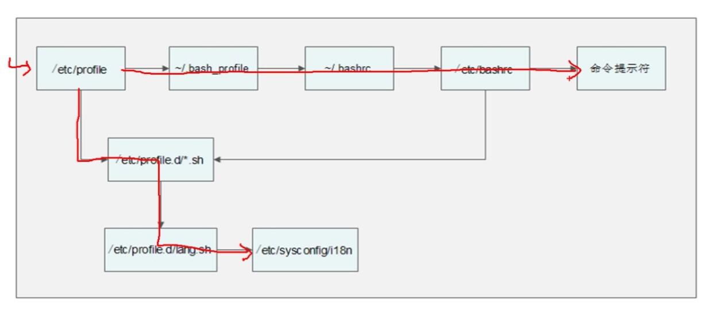
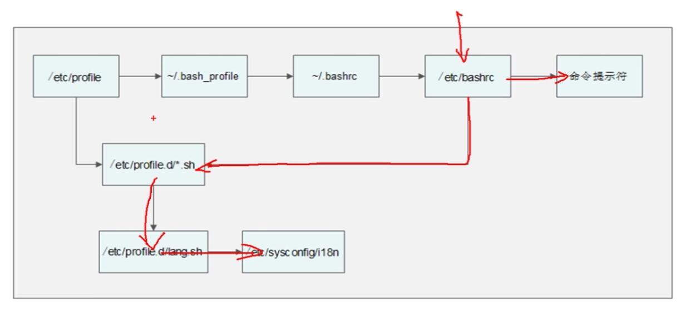

# 环境变量配置文件  
>变量类型

    用户自定义变量（本地变量）
    环境变量：定义每个用户的操作环境，如path,ps1
    预定义变量
    位置参数变量

    source 命令
    source 配置文件
    或 . 配置文件
> 环境变量配置文件简介

    环境变量配置文件中主要是定义对系统操作环境生效的系统默认环境变量，如PATH等

    /etc/profile
    /etc/profile.d/*.sh
    /etc/bashrc
    ~/.bash_profile
    ~/.bashrc
    
# 环境变量配置文件的功能

    用户输入 用户名和密码 正常登陆

    切换超级用户

    /etc/profile的作用
        USER变量：
        LOGNAME变量：
        MAIL变量：
        PATH变量：
        HOSTNAME变量：
        HISTORY变量：
        umask：
        调用/etc/profile.d/*.sh文件

    umask   #查看系统默认权限
    注意：
        1.文件最高权限为666
        2.目录最高权限为777
        3.权限不能使用数字进行换算，而必须使用字母
        4.umask定义的权限，是系统默认权限中准备丢弃的权限

    /etc/bashrc的作用
        PS1变量
        umask
        PATH变量
        调用/etc/profile.d/*.sh文件

    ~/.bash_profile的作用
        调用了~/.bashrc文件
        在PATH变量后面加入了 “:$HOME/bin”这个目录
        
    ~/.bashrc的作用
        定义默认别名
        调用/etc/bashrc

# 其他配置文件  
    1.注销时生效的环境变量配置文件
        ~/.bash_logout

    2.历史环境变量文件
    ~/.bash_history

    查看历史命令
    history
    历史命令保存在 ~/.bash_history
    用命令history查看的是所有历史命令，而在文件~/.bash_history中保存的是本次登陆之前的历史命令

    3.Shell登录信息
        /etc/issue      #本地终端欢迎信息
        转义符含义：
            \d：显示当前系统日期
            \s：显示操作系统名称
            \l：显示登陆的终端号，比较常用
            \m：显示硬件体系结构，如i386,i686等
            \n：显示主机名
            \o：显示域名
            \r：显示内核版本
            \t：显示当前系统时间
            \u：显示当前登陆用户的序列号

    远程终端登陆欢迎信息：/etc/issue.net
        1.转义符在/etc/issue.net文件中不能使用
        2.是否显示此欢迎信息，由ssh的配置文件 /etc/ssh/sshd_config 决定，
        加入 Banner /etc/issue.net 行才能显示，
        需要重启SSH服务，service sshd restart

    登陆后欢迎信息： /etc/motd
    不管是本地登录，还是远程登录，都可以显示此欢迎信息

    