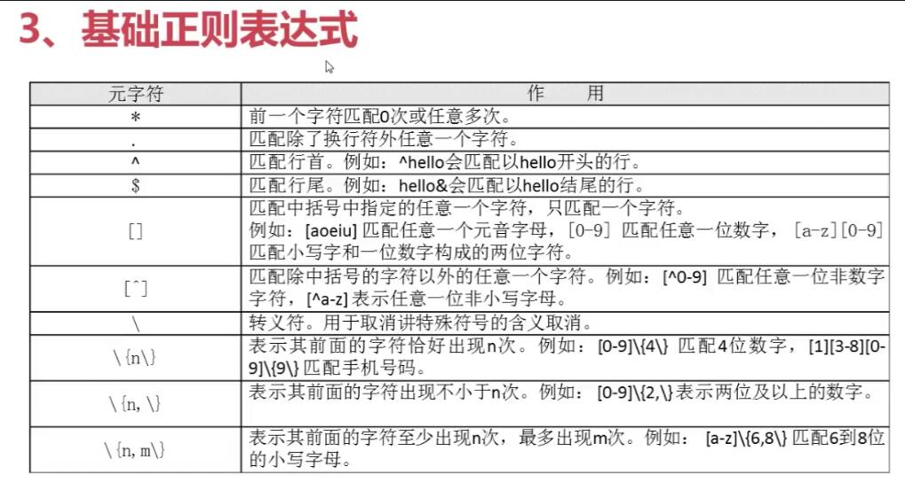

<!-- TOC -->

- [1. 正则表达式](#1-正则表达式)
- [2. 字符截取命令](#2-字符截取命令)
- [3. 字符处理命令](#3-字符处理命令)

<!-- /TOC -->

# 1. 正则表达式
- 正则表达式用来在文件中匹配符合条件的字符串，正则是 包含匹配 。
    grep、awk、sed等命令可以支持正则表达式。
- 通配符用来匹配符合条件的文件名，通配符是完全匹配。
    ls、find、cp等命令不支持正则表达式，所以只能使用shell自己的通配符来进行匹配了。
---
    通配符
    *   匹配任意内容，包括没有内容
    ?   匹配任意一个字符
    []  匹配中括号中的一个字符

    

```sh
    grep "a*" test.txt  # 没有任何含义
    grep "aa*" test.txt # a重复1次或多次
    
    "a*"    #匹配所有的内容，包括空白行
    "aa*"   # 匹配至少包含有一个 a 的行
    "aaa*"  # 匹配最少包含两个连续a的字符串
    "aaaa*" # 匹配最少包含四个连续 a 的字符串

    grep "s..d" test.txt    #匹配s和d中间有两个字符的行
    grep ".*"   test.txt    #匹配所以内容

    "^"     #匹配行首
    "$"     #匹配行尾
    "^M"    #匹配以大写 “M” 开头的行
    "n$"    #匹配以小写 “n   结尾的行
    "^$"    #匹配空白行

    "[]"    #匹配中括号中指定的任意一个字符，只匹配一个字符
    "s[ao]id"   # 匹配s和i字母中，是a或o的行
    "[0-9]"     # 匹配任意一个数字
    "^[a-z]"    # 匹配用小写字母开头的行

    "\ "     # 转移符
    "\.$"    # 匹配使用 . 结尾的行
    ".$"     # 匹配任意字符结尾的行，不包括空行
    
    "\{n\}"     # 表示其前面的字符恰好出现n次
    "a\{3\}"    # 匹配 a 字母连续出现三次的字符串
    "[0-9]\{3\}"    # 匹配包含连续三个数字的字符串

    "\{n,m\}"   # 匹配其前面的字符至少出现n次，最多出现m次
    "sa\{1,3\}i" # 匹配在字母s和字母i之间最少有一个a，最多有三个a
```

```sh
    [0-9]\{4\}-[0-9]\{2\}-[0-9]\{2\}    # 匹配日期格式 YYYY-MM-DD
    [0-9]\{1,3\}\.[0-9]\{1,3\}\.[0-9]\{0,3\}\.[0-9]\{1,3\}     # 匹配IP地址
```
# 2. 字符截取命令

> cut 字段提取命令

> printf 命令

    printf '输出类型输出格式' 输出内容
    输出类型：
        %ns：输出字符串。n是数字指代输出几个字符
        %ni：输出整数。n是数字指代输出几个数字
        %m.nf：输出浮点数。m个n是数字，指代输出的整数位数和小数位数
            如：%8.2f代表共输出8位，其中2位是小数，6位是整数
    输出格式：
        \a：输出警告音
        \b：输出退格键，Backspace
        \f：清除屏幕
        \n：换行
        \r：回车，Enter
        \t：水平输出Tab键
        \v：垂直输出Tab键

```sh
    #studtnt.txt里面的数据有
    ID  NAME    gender  Mark
    1   tom     M       87
    2   jony    M       95
    3   green   F       87

    printf '%s\t%s\t%s\n' 1 2 3 4 5 6
    printf '%s\t%s\t%s\t%s\n' student.txt
```
> awk 命令

awk默认使用空格或tab作为分割符号，变更分隔符号使用FS
在awk命令的输出中支持print和printf命令
- print命令：print会在每个输出之后自动加入一个换行符号（linux默认没有print命令）
- printf命令：printf是标准格式输出命令，并不会自动加入换行符号，如需要换行，需要手工加入换行符号
---
    awk '条件1{动作1} 条件2{动作2}...' 文件名
    条件（Pattern）：    
        一般使用关系表达式作为条件
        x>10 判断变量x是否大于10
        x>=10   大于等于
        x<10    小于
    动作（Action）
        格式化输出
        流程控制语句

```sh
    awk '{printf $2 "\t" $4 "\n"}' student.txt

    df -h | awk '{print $1 "\t" $3}'

    awk 'BEGIN{pirnt "test"} {print $2 "\t" $4}' student.txt
    awk 'END{pirnt "test"} {print $2 "\t" $4}' student.txt

    FS内置变量
    cat /etc/passwd | grep "/bin/bash" | awk 'BEGIN{FS=":"} {printf $1 "\t" $3 "\n"}'

    cat student.txt | grep -v ID | awk '$4>=90 {print $2}'
```
> sed 命令

    sed是一种几乎包括所有UNIX平台（包括Linux）的轻量级流编辑器。
    sed主要是用来将数据进行选取、替换、删除、新增的命令。

    sed [选项] '动作' 文件名
    选项：
        -n：一般sed命令会把所有数据都输出到屏幕，如果加入此选项则会把sed命令处理的行输出到屏幕。
        -e：允许对输入数据应用多条sed命令编辑，中间用;隔开
        -i：用sed的修改结果直接修改读取数据的文件，而不是由屏幕输出
    动作：
        a：追加，在当前行后面添加一行或多行
        c：行替换，用c后面的字符串替换原数据行
        i：插入，在当前行插入一行或多行。
        d：删除，删除指定的行
        p：打印，输出指定的行
        s：字符串替换，用一个字符串替换另外一个字符串。格式 ”行范围s/旧字符串/新字符串/g”（和vim中的替换格式类似）。

```sh
    sed '2p' student.txt    # 打印了所有文档
    sed -n '2p' student.txt # 打印指定行

    sed '2d' student.txt    # 删除第二行
    sed '2,4d' student.txt  # 删除第二到第四行，并没有保存到文件 
    sed -i '2d' student.txt # 删除第二行，并保存
    
    sed '2a hahahahah' student.txt  # 在后面
    sed '2i hahahahah' student.txt  # 在前面

    sed '2c jony is good!' student.txt  # 整行替换
    sed '4s/87/90/g' student.txt    #将第四行的87修改为90，/g为如果有多个，则全部替换

    sed -e 's/tom//g;s/jony//g' student.txt #没有指定行号搜索整篇文档，/g为多处全部替换
```


# 3. 字符处理命令

    sort [选项] 文件名
    选项：
        -f：忽略大小写
        -n：以数值型进行排序，默认使用字符串排序
        -r：反向排序
        -t：指定分隔符，默认的分隔符是制表符
        -k,n[,m]：按照指定的字段范围排序。从第n字段开始，m字段结束（默认到行尾）

```sh
    sort /etc/passwd        # 排序用户信息
    sort -r /etc/passwd     # 方向排序

    sort -t ":" -k "3,3" /etc/passwd        # 指定分隔符是 ：用第三个字段开头，第三个字段结尾，就是只用第三个字段排序
    sort -n -t ":" -k "3,3" /etc/passwd     # 以数值大小进行排序
    
    sort -n -t ":" -k "3,3" /etc/passwd | cut -d ":" -f3    #等效于下面
    cut -d ":" -f3 | sort -n

```
    wc 统计命令
    wc [选项] 文件名
    选项：
        -l：只统计行数
        -w：只统计单词数
        -m：只统计字符数

```sh
    wc /etc/passwd      # 显示统计结果，行数、单词数、字符数
    wc -l /etc/passwd   # 只统计行数
```
