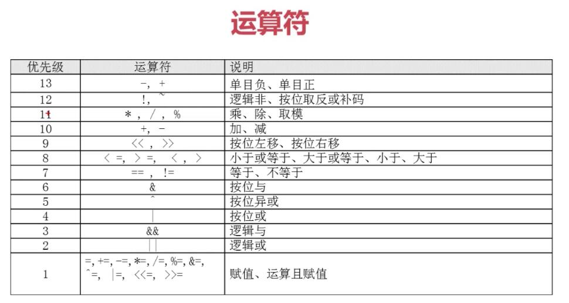
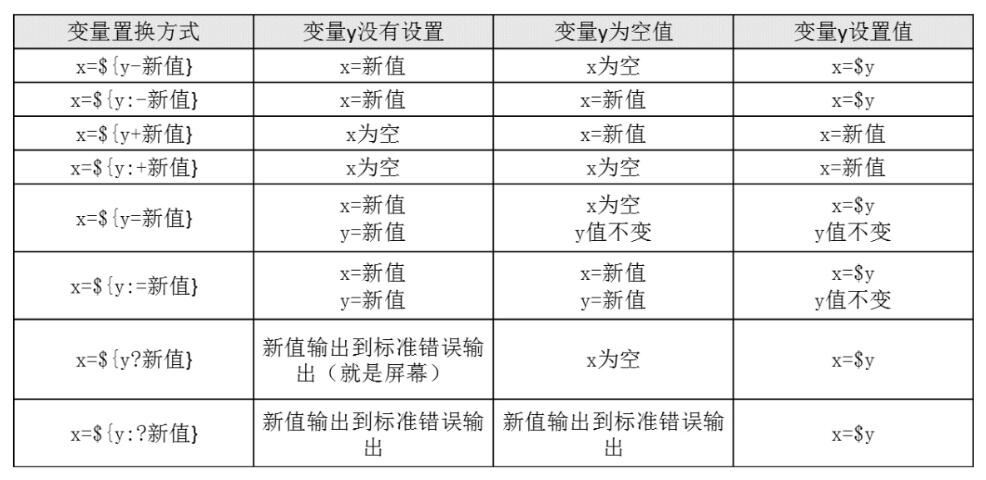

# shell编程之运算符

    shell变量的缺点？
        弱类型
        默认字符型
## declare命令

    declare:声明变量类型
    declare [+/-][选项] 变量名
    选项：
        -：给变量设置类型属性
        +：取消变量的类型属性
        -a：将变量声明为数值型
        -i：将变量声明为整数型（interger）
        -x：将变量声明为环境变量
        -r：将变量声明为只读变量（尽量不要做该操作，因为 +r 不可取消）

        -p：显示指定变量的被声明类型
```sh
    # 给变量aa和bb赋值
    aa=11
    bb=22
    declare -i cc=$aa+$bb

    #定义数组
    movie[0]=zp
    movie[1]=tp
    declare -a movie[2]=live
    #查看数组
    echo ${movie}       # 显示第一个数组元素
    echo ${movie[2]}    # 显示第三个数组元素
    echo ${movie[*]}    # 显示所有数组元素

    declare -x test=123     # 和export作用相似，但其实是 declare 命令的作用

    declare -r test     # 给 test 变量赋予只读属性，
                        # 但是请注意只读属性会让变量不能修改，不能删除，
                        # 甚至不能取消只读属性

    declare -p      # 查询所有变量的属性
    declare -p ls   # 查询指定变量的属性
```
## 数值运算方法
方法1：declare -i 命令
```sh
    aa=11
    bb=22
    declare -i cc=$aa+$bb
```
方法2：expr或let数值运算工具
```sh
    dd=$(expr $aa + $bb)
    # dd的值是aa和bb的和。注意 + 号左右两侧必须有空格
```
方法3："$((运算式)) 或 "$[运算式]"
```sh
    ee = $(($aa + $bb))
    ff = $[$aa + $bb]
```
运算符



## 变量测试

